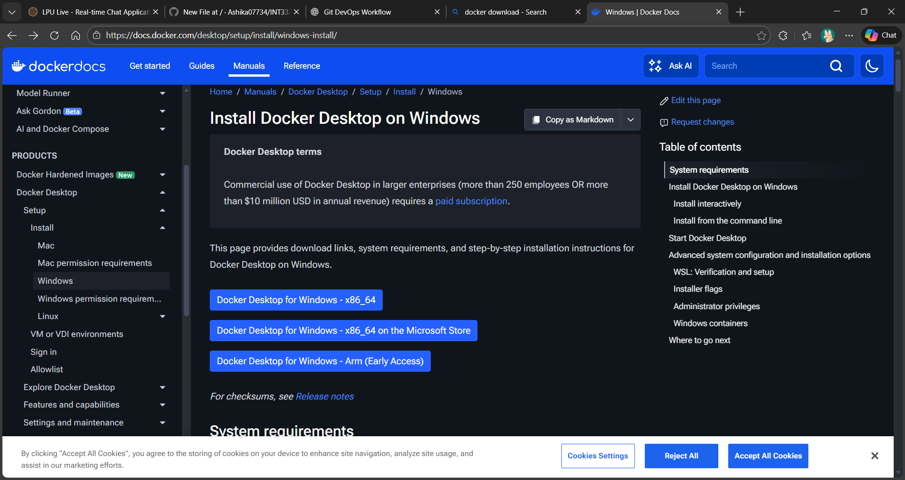
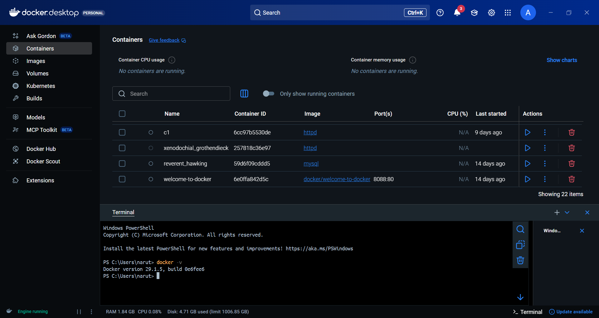

# Docker Download and Installation

This section covers the complete process of downloading and installing
Docker on a system, along with verification steps.

Screenshots are added at appropriate stages for better understanding.

---

## Step 1: Download Docker

Docker should always be downloaded from the official Docker website.

- Select the operating system (Windows / Linux)
- Download the stable version

📸 Screenshot: Docker official download page

---

## Step 2: Install Docker on Windows

1. Run the Docker Desktop installer
2. Enable WSL 2 when prompted
3. Allow required permissions
4. Complete the installation and restart the system
   
---

## Step 3: Install Docker on Linux (Overview)

1. Update system packages
2. Install Docker Engine
3. Start and enable Docker service

---

## Step 4: Verify Installation

To verify Docker installation:

- Check Docker version
- Run a sample container

Successful execution confirms Docker is installed correctly.

📸 Screenshot: Docker installed successfully

---

## Importance in DevOps

Correct installation ensures:
- Stable container execution
- Reliable CI/CD pipelines
- Consistent development and production environments

---

## Conclusion

Docker installation is the foundation for container-based DevOps workflows.
Ensuring correct setup avoids issues in later stages.

